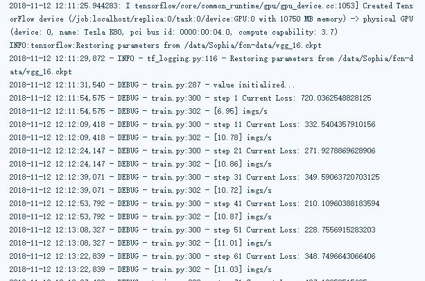
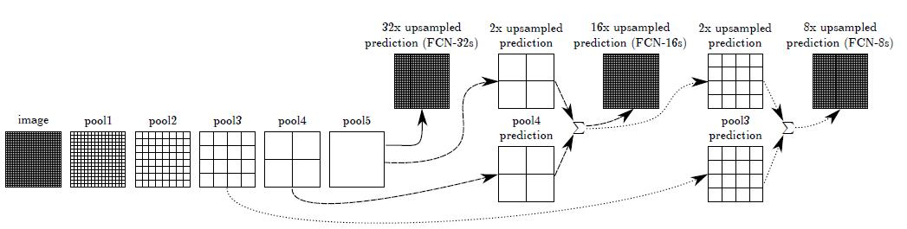

# FCN心得体会

## 1、训练数据准备

修改convert_fcn_dataset.py代码，生成TFRecord数据。

生成example：dict_to_tf_example()

```python
# 文件名
filename = data.split('/')[-1].rstrip('.jpg').encode()

feature_dict = {
        'image/height':tf.train.Feature(int64_list=tf.train.Int64List(value=[height])),
        'image/width': tf.train.Feature(int64_list=tf.train.Int64List(value=[width])),
        'image/filename': tf.train.Feature(bytes_list=tf.train.BytesList(value=[filename])),
        'image/encoded': tf.train.Feature(bytes_list=tf.train.BytesList(value=[encoded_data])),
        'image/label': tf.train.Feature(bytes_list=tf.train.BytesList(value=[encoded_label])),
        'image/format': tf.train.Feature(bytes_list=tf.train.BytesList(value=[b'jpg'])),
    }

```

生成tfrecord文件：create_tf_record()

```python
tfrecord_writer = tf.python_io.TFRecordWriter(output_filename)
for data,label in file_pars:
    example = dict_to_tf_example(data,label)
    if example != None:
        print(data)
        tfrecord_writer.write(example.SerializeToString())
```

## 2、模型训练日志



## 3、FCN理解



FCN模型结构如上图所示。

代码思路如下：

-  先将pool4的结果进行一次卷积操作，核为1×1，featuremap为21的卷积，使14×14×512转化为14×14×21的特征图。
- 将VGG网络的出的logits进行一次反卷积的过程，用双线性插值的方法，因子为×2，输出的大小为上步操作的结果大小，也就是14×14×21。
- 将上诉两者的结果进行相加，得到结果a。
- 再将pool3的结果进行一次卷积操作，核为1×1，featuremap为21的卷积，使28×28×256转化为28×28×21的特征图。
- 将结果a进行一次反卷积的过程，也是用双线性插值的方法，因子为×2，输出的大小为上步操作的结果大小，也就是28×28×21。
- 再把上两者的结果进行相加，得到结果b。
- 最后将结果b进行×8的上采样，也就是反卷积过程，得到原图224×224×21的结果。
- 再经过一个CRF条件随机场，可以得到更精确的结果。